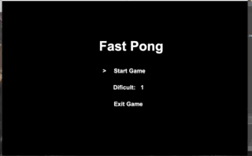

# Hi there!! 👋

 ### CONGRATULATIONS!! you finnaly found my github profile! 😄

## :book: About me:

* I am a fourth year Computer engineering grad student at Universidade Federal de Mato Grosso (UFMT) in Brasil.

* I'm a very open person, fell free to fork or use any of my projects :)

* Fell free to reach me for any reason ;)

## Languages and Tools 

## Operating systems i have experience with: 

## My currently favorite repositories:

&emsp;&emsp;&emsp;&emsp;**Calculator** &emsp;&emsp;&emsp;&emsp;&emsp;&emsp;&emsp;**Fast-Pong**&emsp;&emsp;&emsp;&emsp;&emsp;&emsp;**Harmonie-Web-site**

 

&emsp;&emsp;&ensp;**(Pyhton and Kivy)** &emsp;&emsp;&emsp;&emsp;&emsp;&nbsp;**(Only Java)**&emsp;&emsp;&emsp;&emsp;**(Only HTML, CSS and JS)**

## What am i currently up to:

* I'm making web-applications with pure HTML, CSS an JS (no angular or react like frameworks for now) as a freelancer (some times) and also learning more and more about the web-development world every day.

* I'm slowly learning about back-end using Node.js, PHP, MySQL.

* I'm currently learning game development at danki code platform, where i'm learning to make since simple 2d games (such as pong and mario) with java, to complex 3d games with c++ and build my own game engines, and learn how to use the big game engines out there such as Unity and Unreal.

* Learning to make desktop applications with Kivy, gtk and others graphical libraries.

* Working in projects with 3d printing and robotics.

## What am I looking for:

* I'm looking for a remote internship in US (web development, game development, Data engeneering or even hardware engeneering).

* Colaborate with open source projects.

* Learn how to make firmwares and embaded systems softwares with a graphical interface using libraries such as Lvgl using C, in the near future. 

* I am plannig to learn more about artifial intelligence, machine learning,data science and NLP in the near future.  

## How to reach me:

**You can always email me (luisoctaviogalessoseror@protonmail.com)**

**or call me in:**

 

<!--
**LuisOctavioGSeror/LuisOctavioGSeror** is a ✨ _special_ ✨ repository because its `README.md` (this file) appears on your GitHub profile.

Here are some ideas to get you started:

- 🔭 I’m currently working on ...
- 🌱 I’m currently learning ...
- 👯 I’m looking to collaborate on ...
- 🤔 I’m looking for help with ...
- 💬 Ask me about ...
- 📫 How to reach me: ...
- 😄 Pronouns: ...
- ⚡ Fun fact: ...
-->
